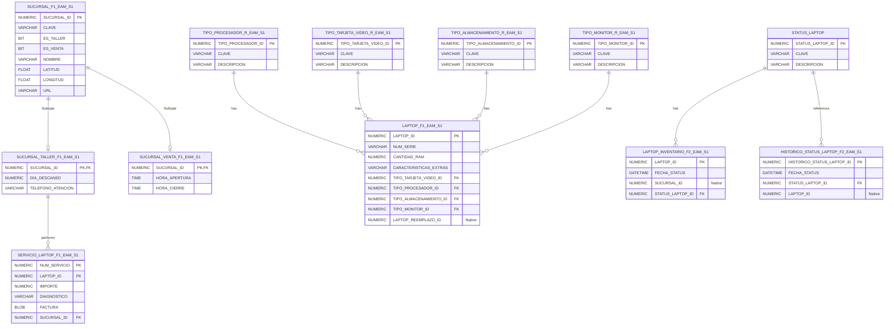
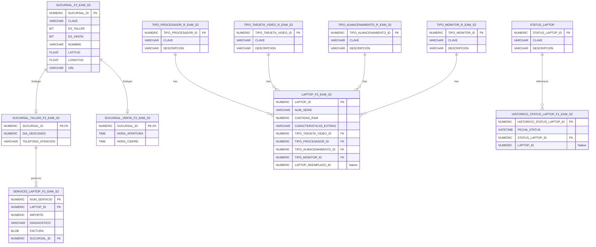
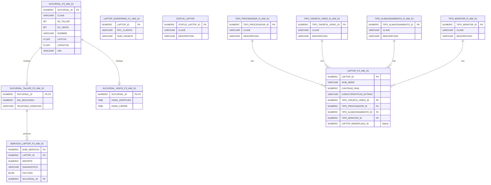
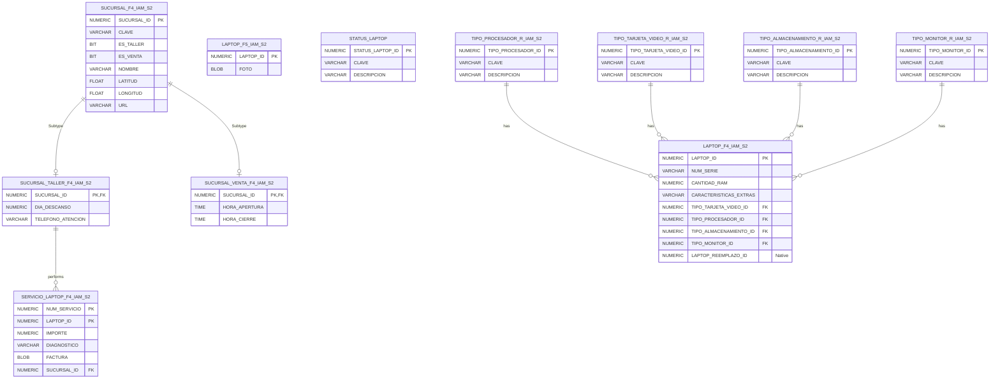

# UNIVERSIDAD NACIONAL AUTÓNOMA DE MÉXICO
## FACULTAD DE INGENIERÍA
### BASES DE DATOS DISTRIBUIDAS (SEMESTRE 2026-2)
### PROYECTO FINAL - PARTE 1: DISEÑO DEL ESQUEMA DE FRAGMENTACIÓN
---

**Alumno:** Erick Yair Aguilar Martínez  
**Correo:** martinezerickaguilar@gmail.com  
**Cuenta:** 319061280  
**Grupo:** 1  
**Profesor:** Ing. Jorge A. Rodríguez C.  
**Entorno de Control:** Contenedor Docker: `c1-bdd-eam` (RDBMS Oracle 23ai Free)  

---

## 1. Resumen de Reglas de Negocio y Requerimientos

La empresa **iLap** comercializa y repara laptops de alto desempeño a nivel global. Para optimizar su operación y paralelizar consultas, se diseña un esquema de base de datos distribuida en **4 nodos**, cuyas características y restricciones son:

1. **Sucursales (`SUCURSAL` y subtipos):**
   - Clave: `EEZZ000000` (EE: Estado, ZZ: Zona, 000000: Consecutivo).
   - Zona `NO` y sucursales de venta y taller simultáneas $\rightarrow$ **Sitio Norte** (Nodo 1).
   - Resto de sucursales según su zona (`EA`, `WS`, `SO`) $\rightarrow$ Sitios **Este** (Nodo 2), **Oeste** (Nodo 3) y **Sur** (Nodo 4).
   - Los subtipos `SUCURSAL_TALLER` y `SUCURSAL_VENTA` se fragmentan mediante **fragmentación horizontal derivada** del fragmento correspondiente de `SUCURSAL`.

2. **Laptops (`LAPTOP`):**
   - Fragmentación por el primer dígito de `NUM_SERIE`:
     - `[0-1]` $\rightarrow$ **Sitio Norte** (Nodo 1).
     - `[6-9]` $\rightarrow$ **Sitio Este** (Nodo 2).
     - `[4-5]` $\rightarrow$ **Sitio Oeste** (Nodo 3).
     - `[2-3]` $\rightarrow$ **Sitio Sur** (Nodo 4).
   - **Excepción de Foto:** Las fotos de todas las laptops se almacenan en el **Sitio Sur** (Nodo 4), que es el especialista en tratamiento de imágenes (fragmentación vertical/híbrida).

3. **Datos de Inventario (`LAPTOP_INVENTARIO`):**
   - Es una extensión 1:1 de `LAPTOP` que se fragmenta verticalmente:
     - Datos seguros (`RFC_CLIENTE`, `NUM_TARJETA`) $\rightarrow$ **Sitio Oeste** (Nodo 3), que cuenta con herramientas de cifrado y privacidad.
     - Resto de atributos (`FECHA_STATUS`, `STATUS_LAPTOP_ID`, `SUCURSAL_ID`) $\rightarrow$ **Sitio Norte** (Nodo 1) (mayor capacidad de procesamiento).

4. **Histórico de Estatus (`HISTORICO_STATUS_LAPTOP`):**
   - Historial hasta el año 2009 $\rightarrow$ **Sitio Este** (Nodo 2) (mayor almacenamiento).
   - Historial posterior a 2009 (2010 en adelante) $\rightarrow$ **Sitio Norte** (Nodo 1) (mayor procesamiento).

5. **Servicios de Reparación (`SERVICIO_LAPTOP`):**
   - **Estrategia Seleccionada:** Distribuir con base en la ubicación de las sucursales (talleres). Los servicios se fragmentan horizontalmente de forma derivada de `SUCURSAL_TALLER` para mantener la co-localización de los diagnósticos y facturas con la sucursal que prestó el servicio.

---

## 2. Tabla de Asignación de Sitios (Topología de Red)

Dado que se realiza el proyecto de forma **individual**, se simula a los dos integrantes modificando la primera letra de las iniciales por la letra `I` (**Individual**). Iniciales del alumno: `EAM` (Erick Yair Aguilar Martínez) e `IAM`.

| Num. Nodo | Nombre Nodo | Características del Sitio | Nombre Global de la PDB | Sufijo para Fragmentos |
| :---: | :---: | :---: | :---: | :---: |
| **1** | **Norte (NO)** | Mayor capacidad de procesamiento | `eambdd_s1.fi.unam` | `EAM_S1` |
| **2** | **Este (EA)** | Mayor capacidad de almacenamiento | `eambdd_s2.fi.unam` | `EAM_S2` |
| **3** | **Oeste (WS)** | Herramientas de seguridad y privacidad (cifrado) | `iambdd_s1.fi.unam` | `IAM_S1` |
| **4** | **Sur (SO)** | Especializado en tratamiento de imágenes | `iambdd_s2.fi.unam` | `IAM_S2` |

---

## 3. Tabla de Fragmentación de la BDD

Los predicados se especifican como expresiones SQL válidas listas para implementar en Oracle.

| Nombre del Fragmento | Tipo de Fragmentación | Ubicación (Nodo / PDB) | Expresión Algebraica / Predicado SQL |
| :--- | :--- | :---: | :--- |
| **SUCURSAL_F1_EAM_S1** | Horizontal Primaria | Nodo 1 (`EAM_S1`) | `(ES_VENTA = 1 AND ES_TALLER = 1) OR SUBSTR(CLAVE, 3, 2) = 'NO'` |
| **SUCURSAL_F2_EAM_S2** | Horizontal Primaria | Nodo 2 (`EAM_S2`) | `NOT (ES_VENTA = 1 AND ES_TALLER = 1) AND SUBSTR(CLAVE, 3, 2) = 'EA'` |
| **SUCURSAL_F3_IAM_S1** | Horizontal Primaria | Nodo 3 (`IAM_S1`) | `NOT (ES_VENTA = 1 AND ES_TALLER = 1) AND SUBSTR(CLAVE, 3, 2) = 'WS'` |
| **SUCURSAL_F4_IAM_S2** | Horizontal Primaria | Nodo 4 (`IAM_S2`) | `NOT (ES_VENTA = 1 AND ES_TALLER = 1) AND SUBSTR(CLAVE, 3, 2) = 'SO'` |
| **SUCURSAL_TALLER_F1_EAM_S1** | Horizontal Derivada | Nodo 1 (`EAM_S1`) | `SUCURSAL_TALLER ⋉ SUCURSAL_F1_EAM_S1` |
| **SUCURSAL_TALLER_F2_EAM_S2** | Horizontal Derivada | Nodo 2 (`EAM_S2`) | `SUCURSAL_TALLER ⋉ SUCURSAL_F2_EAM_S2` |
| **SUCURSAL_TALLER_F3_IAM_S1** | Horizontal Derivada | Nodo 3 (`IAM_S1`) | `SUCURSAL_TALLER ⋉ SUCURSAL_F3_IAM_S1` |
| **SUCURSAL_TALLER_F4_IAM_S2** | Horizontal Derivada | Nodo 4 (`IAM_S2`) | `SUCURSAL_TALLER ⋉ SUCURSAL_F4_IAM_S2` |
| **SUCURSAL_VENTA_F1_EAM_S1** | Horizontal Derivada | Nodo 1 (`EAM_S1`) | `SUCURSAL_VENTA ⋉ SUCURSAL_F1_EAM_S1` |
| **SUCURSAL_VENTA_F2_EAM_S2** | Horizontal Derivada | Nodo 2 (`EAM_S2`) | `SUCURSAL_VENTA ⋉ SUCURSAL_F2_EAM_S2` |
| **SUCURSAL_VENTA_F3_IAM_S1** | Horizontal Derivada | Nodo 3 (`IAM_S1`) | `SUCURSAL_VENTA ⋉ SUCURSAL_F3_IAM_S1` |
| **SUCURSAL_VENTA_F4_IAM_S2** | Horizontal Derivada | Nodo 4 (`IAM_S2`) | `SUCURSAL_VENTA ⋉ SUCURSAL_F4_IAM_S2` |
| **LAPTOP_F1_EAM_S1** | Híbrida (V + H) | Nodo 1 (`EAM_S1`) | `SUBSTR(NUM_SERIE, 1, 1) IN ('0', '1')` (Excluye columna `FOTO`) |
| **LAPTOP_F2_EAM_S2** | Híbrida (V + H) | Nodo 2 (`EAM_S2`) | `SUBSTR(NUM_SERIE, 1, 1) IN ('6', '7', '8', '9')` (Excluye columna `FOTO`) |
| **LAPTOP_F3_IAM_S1** | Híbrida (V + H) | Nodo 3 (`IAM_S1`) | `SUBSTR(NUM_SERIE, 1, 1) IN ('4', '5')` (Excluye columna `FOTO`) |
| **LAPTOP_F4_IAM_S2** | Híbrida (V + H) | Nodo 4 (`IAM_S2`) | `SUBSTR(NUM_SERIE, 1, 1) IN ('2', '3')` (Excluye columna `FOTO`) |
| **LAPTOP_F5_IAM_S2** | Vertical | Nodo 4 (`IAM_S2`) | `π LAPTOP_ID, FOTO (LAPTOP)` (Almacena todas las fotos globales) |
| **LAPTOP_INVENTARIO_F1_IAM_S1**| Vertical | Nodo 3 (`IAM_S1`) | `π LAPTOP_ID, RFC_CLIENTE, NUM_TARJETA (LAPTOP_INVENTARIO)` |
| **LAPTOP_INVENTARIO_F2_EAM_S1**| Vertical | Nodo 1 (`EAM_S1`) | `π LAPTOP_ID, FECHA_STATUS, SUCURSAL_ID, STATUS_LAPTOP_ID (LAPTOP_INVENTARIO)` |
| **HISTORICO_STATUS_LAPTOP_F1_EAM_S2**| Horizontal Primaria | Nodo 2 (`EAM_S2`) | `FECHA_STATUS < TO_DATE('01/01/2010', 'DD/MM/YYYY')` |
| **HISTORICO_STATUS_LAPTOP_F2_EAM_S1**| Horizontal Primaria | Nodo 1 (`EAM_S1`) | `FECHA_STATUS >= TO_DATE('01/01/2010', 'DD/MM/YYYY')` |
| **SERVICIO_LAPTOP_F1_EAM_S1** | Horizontal Derivada | Nodo 1 (`EAM_S1`) | `SERVICIO_LAPTOP ⋉ SUCURSAL_TALLER_F1_EAM_S1` |
| **SERVICIO_LAPTOP_F2_EAM_S2** | Horizontal Derivada | Nodo 2 (`EAM_S2`) | `SERVICIO_LAPTOP ⋉ SUCURSAL_TALLER_F2_EAM_S2` |
| **SERVICIO_LAPTOP_F3_IAM_S1** | Horizontal Derivada | Nodo 3 (`IAM_S1`) | `SERVICIO_LAPTOP ⋉ SUCURSAL_TALLER_F3_IAM_S1` |
| **SERVICIO_LAPTOP_F4_IAM_S2** | Horizontal Derivada | Nodo 4 (`IAM_S2`) | `SERVICIO_LAPTOP ⋉ SUCURSAL_TALLER_F4_IAM_S2` |
| **STATUS_LAPTOP** | Copia Local Estática | Todos (1, 2, 3, 4) | `COPIA MANUAL` / `TABLA REPLICADA` |
| **TIPO_PROCESADOR_R_\*** | Tabla Replicada | Todos (1, 2, 3, 4) | `TABLA REPLICADA` |
| **TIPO_TARJETA_VIDEO_R_\*** | Tabla Replicada | Todos (1, 2, 3, 4) | `TABLA REPLICADA` |
| **TIPO_ALMACENAMIENTO_R_\***| Tabla Replicada | Todos (1, 2, 3, 4) | `TABLA REPLICADA` |
| **TIPO_MONITOR_R_\*** | Tabla Replicada | Todos (1, 2, 3, 4) | `TABLA REPLICADA` |

---

## 4. Expresiones de Reconstrucción Global

La reconstrucción en el DDBMS se define mediante álgebra relacional para asegurar la transparencia de fragmentación.

1. **Sucursales y subtipos:**
   $$\text{SUCURSAL} = \text{SUCURSAL\_F1} \cup \text{SUCURSAL\_F2} \cup \text{SUCURSAL\_F3} \cup \text{SUCURSAL\_F4}$$
   $$\text{SUCURSAL\_TALLER} = \text{SUCURSAL\_TALLER\_F1} \cup \text{SUCURSAL\_TALLER\_F2} \cup \text{SUCURSAL\_TALLER\_F3} \cup \text{SUCURSAL\_TALLER\_F4}$$
   $$\text{SUCURSAL\_VENTA} = \text{SUCURSAL\_VENTA\_F1} \cup \text{SUCURSAL\_VENTA\_F2} \cup \text{SUCURSAL\_VENTA\_F3} \cup \text{SUCURSAL\_VENTA\_F4}$$

2. **Laptops (Reconstrucción Híbrida):**
   $$\text{LAPTOP} = (\text{LAPTOP\_F1} \cup \text{LAPTOP\_F2} \cup \text{LAPTOP\_F3} \cup \text{LAPTOP\_F4}) \bowtie_{\text{LAPTOP\_ID}} \text{LAPTOP\_F5}$$

3. **Inventario de Laptops (Reconstrucción Vertical):**
   $$\text{LAPTOP\_INVENTARIO} = \text{LAPTOP\_INVENTARIO\_F1} \bowtie_{\text{LAPTOP\_ID}} \text{LAPTOP\_INVENTARIO\_F2}$$

4. **Histórico de Estatus:**
   $$\text{HISTORICO\_STATUS\_LAPTOP} = \text{HISTORICO\_STATUS\_LAPTOP\_F1} \cup \text{HISTORICO\_STATUS\_LAPTOP\_F2}$$

5. **Servicios de Reparación:**
   $$\text{SERVICIO\_LAPTOP} = \text{SERVICIO\_LAPTOP\_F1} \cup \text{SERVICIO\_LAPTOP\_F2} \cup \text{SERVICIO\_LAPTOP\_F3} \cup \text{SERVICIO\_LAPTOP\_F4}$$

---

## 5. Modelos Relacionales Locales (Notación Crow's Foot)

Para mantener la integridad física en cada sitio, solo se declaran como restricciones físicas (`Foreign Keys`) aquellas relaciones en las que tanto el registro padre como el hijo se encuentran **co-localizados** en la misma PDB. Las relaciones que cruzan nodos se declaran como campos nativos (sin restricción física `CONSTRAINT FK`).

### 5.1. Nodo 1: Norte (`EAM_S1`)

### 5.2. Nodo 2: Este (`EAM_S2`)

### 5.3. Nodo 3: Oeste (`IAM_S1`)

### 5.4. Nodo 4: Sur (`IAM_S2`)

---

## 6. Conclusiones y Decisiones de Diseño

1. **Eficiencia en la Reconstrucción de Laptops:**
   El uso de fragmentación híbrida en `LAPTOP` permite que las consultas operacionales que no requieren la visualización de la foto se ejecuten de forma local y paralela en cada uno de los nodos reduciendo drásticamente la transferencia de datos de tipo BLOB (`FOTO`). Únicamente las consultas con el detalle visual del catálogo requerirán hacer un Join distribuido con el Nodo 4 (`EAMBDD_S4` / `IAM_S2`).

2. **Co-localización de Servicios de Reparación:**
   Al seleccionar la **Estrategia 1** (distribución de `SERVICIO_LAPTOP` con base en la ubicación de la sucursal taller), se logra mantener la integridad referencial y espacial del negocio. La factura y el diagnóstico (que son pesados debido a su tipo de dato y descripción) se guardan directamente en el mismo sitio físico que atendió la reparación. Esto evita el uso de enlaces de red cruzados para insertar o leer reportes de servicio locales, manteniendo un rendimiento alto para el taller.

3. **Aislamiento de Datos de Alta Privacidad:**
   Los campos `RFC_CLIENTE` y `NUM_TARJETA` se resguardan exclusivamente en el **Nodo 3 (Oeste)**. Esta separación física mediante fragmentación vertical garantiza que ningún otro servidor almacene datos confidenciales de cobro, permitiendo centralizar las políticas de seguridad (cifrado, firewalls, auditorías) únicamente en el Nodo 3, optimizando los recursos de protección de la infraestructura global.
